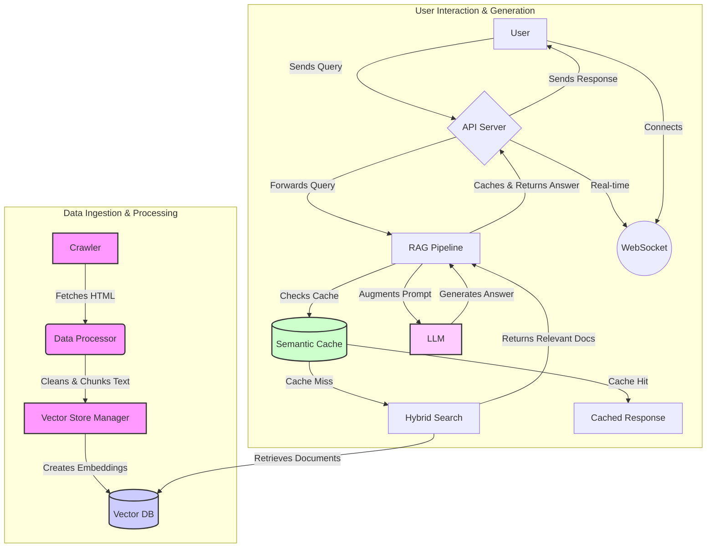

# Chatbot RAG Gunadarma - Backend

## Abstrak

Proyek ini merupakan backend untuk **Chatbot RAG (Retrieval-Augmented Generation) Universitas Gunadarma**, yang dikembangkan sebagai bagian dari penelitian ilmiah. Sistem ini dirancang untuk memberikan jawaban yang akurat dan kontekstual terhadap pertanyaan-pertanyaan seputar Universitas Gunadarma dengan memanfaatkan basis pengetahuan yang dikumpulkan secara spesifik. Dengan mengimplementasikan arsitektur RAG yang canggih, sistem ini mampu mengurangi halusinasi yang sering terjadi pada model bahasa besar (LLM) dan memastikan bahwa jawaban yang diberikan didasarkan pada data yang faktual dan relevan.

Fitur-fitur utama seperti *Hybrid Search*, *Semantic Caching*, dan pemrosesan data secara asinkron diimplementasikan untuk mengoptimalkan akurasi pencarian, meningkatkan kecepatan respons, dan memastikan skalabilitas sistem. Proyek ini dibangun menggunakan teknologi modern seperti **FastAPI**, **LangChain**, dan **Google Generative AI**, serta dikemas dalam **Docker** untuk kemudahan deployment.

---

## Daftar Isi

- [Fitur Utama](#fitur-utama)
- [Arsitektur Sistem](#arsitektur-sistem)
- [Tumpukan Teknologi](#tumpukan-teknologi)
- [Struktur Proyek](#struktur-proyek)
- [Instalasi dan Pengaturan](#instalasi-dan-pengaturan)
  - [Prasyarat](#prasyarat)
  - [Langkah-langkah Instalasi](#langkah-langkah-instalasi)
- [Penggunaan](#penggunaan)
  - [Menjalankan Aplikasi](#menjalankan-aplikasi)
  - [Endpoint API](#endpoint-api)
- [Pengujian](#pengujian)
- [Lisensi](#lisensi)

---

## Fitur Utama

- **Automated Web Crawling**: Sistem secara otomatis mengumpulkan dan memperbarui basis pengetahuan dari situs-situs web Universitas Gunadarma yang telah ditentukan.
- **RAG Pipeline**: Alur kerja RAG yang terstruktur untuk memproses, membersihkan, memotong (chunking), dan mengindeks data teks ke dalam format yang efisien untuk pencarian.
- **Hybrid Search**: Menggabungkan pencarian semantik (berbasis vektor) dengan pencarian kata kunci (TF-IDF) untuk meningkatkan relevansi dan akurasi dokumen yang diambil.
- **Semantic Caching**: Menyimpan cache dari pasangan pertanyaan dan jawaban yang sering muncul untuk mengurangi latensi dan beban pada LLM secara signifikan.
- **RESTful API**: Menyediakan antarmuka API yang bersih dan modern menggunakan FastAPI untuk berinteraksi dengan chatbot.
- **Dukungan WebSocket**: Memfasilitasi komunikasi dua arah secara real-time, memungkinkan pengalaman pengguna yang lebih interaktif.
- **Containerization**: Siap untuk di-deploy menggunakan Docker, memastikan konsistensi lingkungan dari pengembangan hingga produksi.
- **Pemrosesan Asinkron**: Dibangun di atas ASGI (dengan FastAPI dan Uvicorn) untuk menangani banyak permintaan secara bersamaan dengan efisien.

---

## Arsitektur Sistem

Arsitektur sistem ini dirancang secara modular untuk memisahkan setiap komponen fungsional, mulai dari pengumpulan data hingga penyajian jawaban.



**Alur Kerja Data:**

1.  **Crawling**: Modul `crawler` secara periodik mengambil data dari situs web yang telah ditentukan.
2.  **Data Processing**: Teks yang diambil kemudian dibersihkan, dipotong menjadi bagian-bagian yang lebih kecil (chunks), dan disiapkan untuk embedding.
3.  **Indexing**: Setiap *chunk* teks diubah menjadi vektor embedding dan disimpan di dalam *database* vektor (misalnya, PGVector) untuk pencarian cepat.
4.  **User Query**: Pengguna mengirimkan pertanyaan melalui REST API atau WebSocket.
5.  **Semantic Cache Check**: Sistem pertama-tama memeriksa apakah pertanyaan serupa pernah diajukan sebelumnya. Jika ya, jawaban dari *cache* langsung dikembalikan.
6.  **Hybrid Search**: Jika tidak ada di *cache*, *Hybrid Search Manager* melakukan pencarian gabungan (vektor + kata kunci) untuk menemukan dokumen yang paling relevan dari *database* vektor.
7.  **Prompt Augmentation**: Dokumen yang relevan digabungkan dengan pertanyaan asli pengguna untuk membuat *prompt* yang kaya konteks.
8.  **LLM Generation**: *Prompt* yang telah diperkaya dikirim ke *Large Language Model* (LLM) untuk menghasilkan jawaban yang koheren dan relevan.
9.  **Response & Caching**: Jawaban yang dihasilkan dikembalikan kepada pengguna dan juga disimpan di *semantic cache* untuk penggunaan di masa mendatang.

---

## Tumpukan Teknologi

- **Backend Framework**: FastAPI
- **Server**: Uvicorn
- **Data Handling**: Pydantic
- **Orkestrasi AI**: LangChain
- **Model Bahasa**: Google Generative AI (Gemini)
- **Database Vektor**: PGVector (PostgreSQL)
- **Web Crawling**: BeautifulSoup4, Playwright
- **Pencarian Kata Kunci**: Scikit-learn (TF-IDF)
- **Manajemen Dependensi**: uv
- **Containerization**: Docker

---

## Struktur Proyek

```
.
├── app/                # Direktori utama aplikasi
│   ├── api/            # Logika API (endpoints, models, services)
│   ├── crawl/          # Modul untuk web crawling
│   └── rag/            # Implementasi inti RAG pipeline
├── scripts/            # Skrip utilitas untuk setup dan inisialisasi
├── tests/              # Tes otomatis (unit, integrasi)
├── cache/              # Direktori untuk cache (model, data)
├── data/               # Output data dari crawler
├── .env.example        # Contoh file variabel lingkungan
├── main.py             # Titik masuk utama aplikasi
├── pyproject.toml      # Definisi proyek dan dependensi
└── Dockerfile          # Konfigurasi untuk membangun Docker image
```

---

## Instalasi dan Pengaturan

### Prasyarat

- Python 3.11+
- `uv` (Python package manager)
- Docker (untuk menjalankan PostgreSQL dan layanan lainnya)

### Langkah-langkah Instalasi

1.  **Clone Repositori**
    ```bash
    git clone https://github.com/username/chatbot-rag-gunadarma.git
    cd chatbot-rag-gunadarma/backend
    ```

2.  **Buat dan Aktifkan Lingkungan Virtual**
    ```bash
    uv venv
    source .venv/bin/activate  # Linux/macOS
    .venv\Scripts\activate    # Windows
    ```

3.  **Instal Dependensi**
    ```bash
    uv sync
    ```

4.  **Konfigurasi Variabel Lingkungan**
    Salin file contoh `.env.example` menjadi `.env` dan isi variabel yang diperlukan.
    ```bash
    cp .env.example .env
    ```
    Pastikan untuk mengisi variabel berikut di dalam file `.env`:
    - `GOOGLE_API_KEY`: Kunci API Anda untuk Google Generative AI.
    - `DATABASE_URL`: URL koneksi untuk database PostgreSQL.
    - `REDIS_URL` (jika digunakan untuk caching tambahan).

5.  **Jalankan Database & Layanan Lainnya**
    Jika Anda menggunakan Docker, jalankan layanan yang diperlukan:
    ```bash
    docker-compose up -d
    ```

6.  **Inisialisasi Sistem**
    Jalankan skrip setup untuk melakukan crawling, memproses data, dan membangun indeks vektor.
    ```bash
    python -m scripts.run setup --all
    ```

---

## Penggunaan

### Menjalankan Aplikasi

Untuk menjalankan server pengembangan FastAPI:
```bash
uvicorn main:app --host 0.0.0.0 --port 8000 --reload
```
Aplikasi akan tersedia di `http://localhost:8000`. Dokumentasi API interaktif (Swagger UI) dapat diakses di `http://localhost:8000/docs`.

### Endpoint API

| Endpoint             | Method | Deskripsi                                     | Contoh Payload                                                              |
| -------------------- | ------ | --------------------------------------------- | --------------------------------------------------------------------------- |
| `/api/v1/ask`        | `POST` | Mengajukan pertanyaan ke chatbot.             | `{"question": "Fakultas apa saja yang ada di Gunadarma?"}`                  |
| `/api/v1/ask/batch`  | `POST` | Mengajukan beberapa pertanyaan sekaligus.     | `{"questions": ["Pertanyaan 1", "Pertanyaan 2"]}`                           |
| `/api/v1/health`     | `GET`  | Memeriksa status kesehatan layanan.           | -                                                                           |
| `/ws`                | `WS`   | Membuka koneksi WebSocket untuk chat interaktif. | -                                                                           |

**Contoh `curl`:**
```bash
curl -X POST "http://localhost:8000/api/v1/ask" \
-H "Content-Type: application/json" \
-d '{"question": "Apa saja syarat pendaftaran mahasiswa baru?"}'
```

---

## Pengujian

Untuk menjalankan seluruh rangkaian tes otomatis, gunakan `pytest`:
```bash
pytest
```

---

## Lisensi

Proyek ini dilisensikan di bawah Lisensi MIT. Lihat file `LICENSE` untuk detail lebih lanjut.