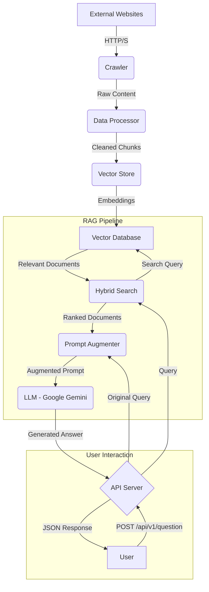

# Chatbot RAG Gunadarma - Backend

## Abstract/Introduction

This project is the backend system for a sophisticated chatbot developed for a scientific research project (*Penelitian Ilmiah*) at Gunadarma University. Its primary purpose is to provide users with accurate, context-aware answers by leveraging a Retrieval-Augmented Generation (RAG) architecture. The system is designed to overcome the limitations of traditional chatbots by grounding its responses in a specific, curated knowledge base obtained from designated web sources. It fetches, processes, and indexes information, allowing the Large Language Model (LLM) to generate responses that are not only fluent but also factually consistent with the source material.

## Table of Contents

- [Core Features](#core-features)
- [System Architecture](#system-architecture)
- [Technology Stack](#technology-stack)
- [Project Structure](#project-structure)
- [Setup and Installation](#setup-and-installation)
- [API Usage and Endpoints](#api-usage-and-endpoints)
- [Running Tests](#running-tests)
- [License](#license)

## Core Features

-   **Automated Web Crawling:** Systematically gathers and updates the knowledge base from specified websites.
-   **RAG Pipeline:** Implements a full data processing pipeline, including cleaning, chunking, embedding, and indexing for efficient retrieval.
-   **Hybrid Search:** Utilizes a combination of semantic (vector) search and traditional keyword-based search to ensure highly relevant document retrieval.
-   **Semantic Caching:** Caches responses to frequently asked questions to deliver near-instantaneous answers and reduce computational load.
-   **RESTful API:** Exposes all chatbot functionalities through a clean, well-documented API built with FastAPI.
-   **WebSocket Support:** Enables real-time, bidirectional communication for a more interactive user experience.
-   **Containerization:** Includes a `Dockerfile` for easy and consistent deployment in any environment.

## System Architecture

The backend is built upon a modular architecture that separates concerns into distinct components: data crawling, the RAG pipeline, and the client-facing API. This design ensures scalability and maintainability.

The data flow is as follows:

1.  **Crawling:** The `crawler` module is initiated to fetch raw data (HTML, PDFs, etc.) from predefined web sources.
2.  **Data Processing:** The raw data is passed to the `rag/data_processor`, which cleans it, extracts relevant text, and splits it into manageable chunks.
3.  **Indexing:** The `rag/vector_store` component takes the processed chunks, generates numerical representations (embeddings) using a sentence-transformer model, and stores them in a vector database for efficient similarity search.
4.  **User Query:** A user submits a question through the REST API.
5.  **Hybrid Search:** The `rag/hybrid_search` module receives the query. It performs a vector search to find semantically similar chunks and a keyword search for exact matches, then intelligently combines the results.
6.  **Prompt Augmentation:** The most relevant document chunks retrieved from the search are combined with the original user query to form a detailed, context-rich prompt.
7.  **LLM Generation:** This augmented prompt is sent to a Large Language Model (e.g., Google's Gemini), which generates a coherent and contextually accurate answer.
8.  **Response:** The final answer is sent back to the user via the API.



## Technology Stack

This project utilizes a modern Python stack for building high-performance AI applications.

-   **Backend Framework:** FastAPI
-   **Web Server:** Uvicorn
-   **Data Validation:** Pydantic
-   **LLM Orchestration:** LangChain
-   **LLM Provider:** Google Generative AI (Gemini)
-   **Vector Embeddings & Search:** Scikit-learn, LangChain Community
-   **Web Crawling:** BeautifulSoup4, Playwright
-   **Async Operations:** aiohttp, asyncio
-   **Database/Storage:** SQLAlchemy, Langchain-Postgres
-   **Real-time Communication:** python-socketio
-   **Dependency Management:** uv
-   **Testing:** Pytest, pytest-asyncio
-   **Linting/Formatting:** Ruff, Black

## Project Structure

The project is organized into logical modules to promote separation of concerns.

```
/
├── app/
│   ├── api/          # Handles all API logic: endpoints, schemas, services.
│   ├── crawl/        # Contains the web crawling and content extraction logic.
│   └── rag/          # Core RAG pipeline: data processing, vector store, hybrid search.
├── scripts/          # Utility scripts for setup, orchestration, and CLI commands.
├── data/             # Stores raw and processed data outputs (e.g., JSON, CSV).
├── cache/            # Caches for models and semantic query responses.
├── tests/            # Automated tests for all application modules.
├── .env.example      # Example environment variables file.
├── main.py           # Main application entry point to start the FastAPI server.
├── pyproject.toml    # Project metadata and dependencies for `uv`.
└── Dockerfile        # Instructions for building the production Docker image.
```

## Setup and Installation

Follow these steps to set up and run the project locally.

**1. Prerequisites**
-   Python 3.12+
-   [uv](https://github.com/astral-sh/uv) Python package installer (`pip install uv`)
-   Git

**2. Clone Repository**
```bash
git clone https://github.com/your-username/chatbot-rag-gunadarma-backend.git
cd chatbot-rag-gunadarma-backend
```

**3. Install Dependencies**
Use `uv` to sync the virtual environment with the locked dependencies.
```bash
uv sync
```

**4. Environment Variables**
Copy the example environment file and fill in the required values.
```bash
cp .env.example .env
```
Now, edit the `.env` file with your specific credentials (e.g., `GOOGLE_API_KEY`, database connection strings).

**5. Run the Application**
Launch the development server using Uvicorn.
```bash
uvicorn main:app --reload
```
The API will be available at `http://127.0.0.1:8000`.

## API Usage and Endpoints

The following are the primary endpoints for interacting with the service.

| Endpoint             | Method | Description                               | Example Payload                               |
| -------------------- | ------ | ----------------------------------------- | --------------------------------------------- |
| `/api/v1/question`   | `POST` | Submits a question to the RAG pipeline.   | `{"text": "What are the admission requirements?"}` |
| `/api/v1/health`     | `GET`  | Checks the operational status of the API. | N/A                                           |
| `/ws`                | `WS`   | Establishes a WebSocket connection.       | N/A                                           |

**Example `curl` command:**

```bash
curl -X POST "http://127.0.0.1:8000/api/v1/question" \
-H "Content-Type: application/json" \
-d '{"text": "Tell me about the computer science curriculum."}'
```

## Running Tests

To ensure the reliability and correctness of the application, run the test suite using pytest.

```bash
pytest tests
```

## License

This project is licensed under the MIT License. See the `LICENSE` file for details.
